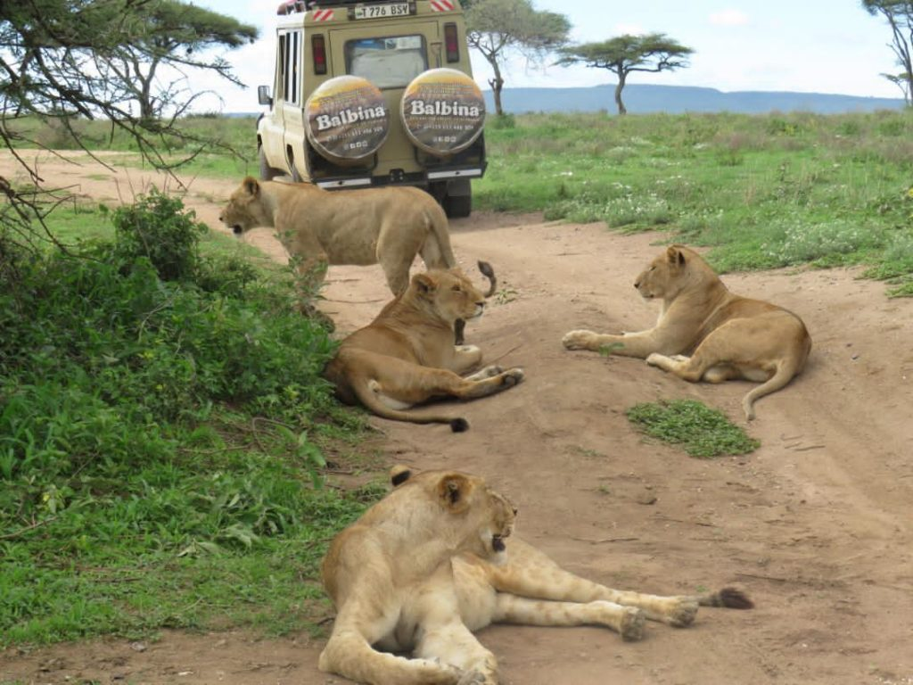
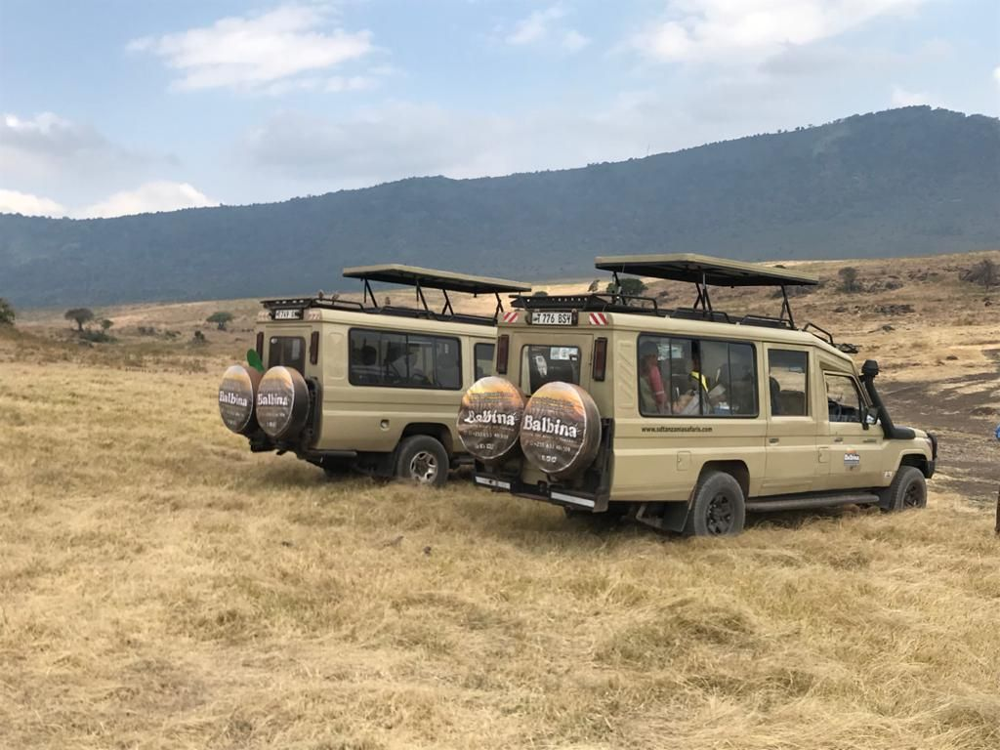
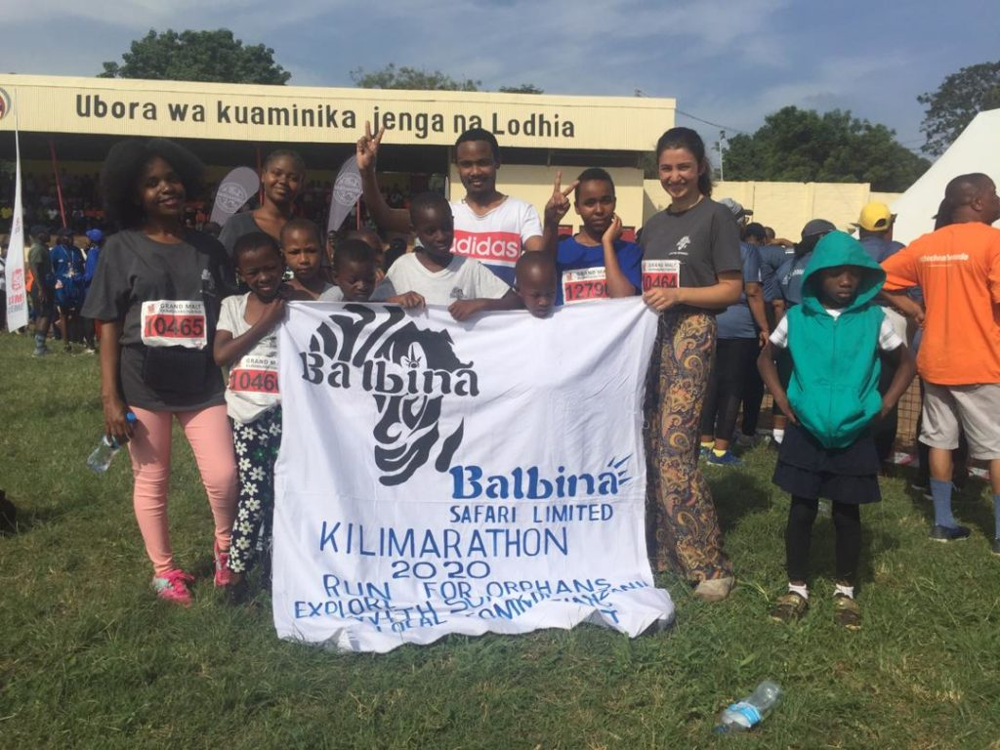

# About Us

##### Balbina Safari Limited Tanzania

Balbina Safari is a tour company, Our company gives you an opportunity to see the beauty of Tanzania. If you are looking for a company to arrange your lodge and camping safaris, trekking and hiking tours and beach holidays you have come to the right place in Tanzania. The head office located at Arusha Tanzania. We are aiming in providing the best service to our guests.

Our core values are what we stand for being passion for service, doing the right way,improving people’s lives and unique adventure and experiences. Our success and rapid growth is due to our people’s dedication. We love what we do and our team strives for excellent service.

We have the special itinerary for bush safari, beach holidays and mountain climbing, school vocations, community activities like visit the Orphanage. We make sure you are enjoying the wildlife experience with Balbina Safari Ltd, we provide you with experienced Guide, a 4X4 vehicle and a well planned safari itinerary. All that will make you happy for your adventure and experience Tanzania.

## WHY BOOK WITH US?

We recommend best products and best services with affordable prices. With our office in Moshi and Arusha we are conveniently situated on-site. Our team will meet you to discuss your itinerary and answer any questions you might have while providing you with up-to-date tips and information. We are here to assist you.

We carefully select our well trained guides, drivers, chefs and porters and we supply gears and equipment for camping safaris and climbing adventures.

Whether you choose to climb Mount Kilimanjaro or Mount Meru or beach holidays to Tanzania coastline and in the islands of Zanzibar or camping safaris and lodge safaris we can guarantee you best services that you will never forget.

We provide Professional Safari Guides, they will make your Vocational enjoyable and memorable.
