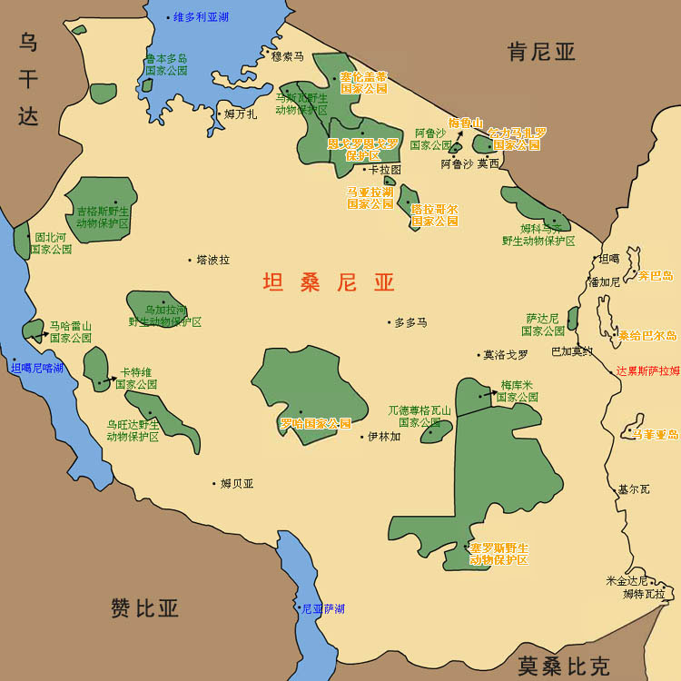

# Day trip Ngorongoro

Safari!

# 火烈鸟

## Balbina Edited at 26
title: 一日游恩戈罗恩戈罗火山口
keywords: [火山口, 动物世界]
hero_image: map.jpg
hero_image_alt: 美丽的地方,火烈鸟
feat_image: map.jpg
feat_image_alt: Super Cool

# 动物世界

title: 一日游恩戈罗恩戈罗火山口
keywords: [火山口, 动物世界]
hero_image: map.jpg
hero_image_alt: 美丽的地方
feat_image: map.jpg
feat_image_alt: Super Cool

title: 一日游恩戈罗恩戈罗火山口
keywords: [火山口, 动物世界]
hero_image: map.jpg
hero_image_alt: 美丽的地方
feat_image: map.jpg
feat_image_alt: Super Cool

title: 一日游恩戈罗恩戈罗火山口
keywords: [火山口, 动物世界]
hero_image: map.jpg
hero_image_alt: 美丽的地方
feat_image: map.jpg
feat_image_alt: Super Cool

title: 一日游恩戈罗恩戈罗火山口
keywords: [火山口, 动物世界]
hero_image: map.jpg
hero_image_alt: 美丽的地方
feat_image: map.jpg
feat_image_alt: Super Cool

title: 一日游恩戈罗恩戈罗火山口
keywords: [火山口, 动物世界]
hero_image: map.jpg
hero_image_alt: 美丽的地方
feat_image: map.jpg
feat_image_alt: Super Cool

title: 一日游恩戈罗恩戈罗火山口
keywords: [火山口, 动物世界]
hero_image: map.jpg
hero_image_alt: 美丽的地方
feat_image: map.jpg
feat_image_alt: Super Cool

title: 一日游恩戈罗恩戈罗火山口
keywords: [火山口, 动物世界]
hero_image: map.jpg
hero_image_alt: 美丽的地方
feat_image: map.jpg
feat_image_alt: Super Cool

title: 一日游恩戈罗恩戈罗火山口
keywords: [火山口, 动物世界]
hero_image: map.jpg
hero_image_alt: 美丽的地方
feat_image: map.jpg
feat_image_alt: Super Cool

title: 一日游恩戈罗恩戈罗火山口
keywords: [火山口, 动物世界]
hero_image: map.jpg
hero_image_alt: 美丽的地方
feat_image: map.jpg
feat_image_alt: Super Cool

title: 一日游恩戈罗恩戈罗火山口
keywords: [火山口, 动物世界]
hero_image: map.jpg
hero_image_alt: 美丽的地方
feat_image: map.jpg
feat_image_alt: Super Cool
